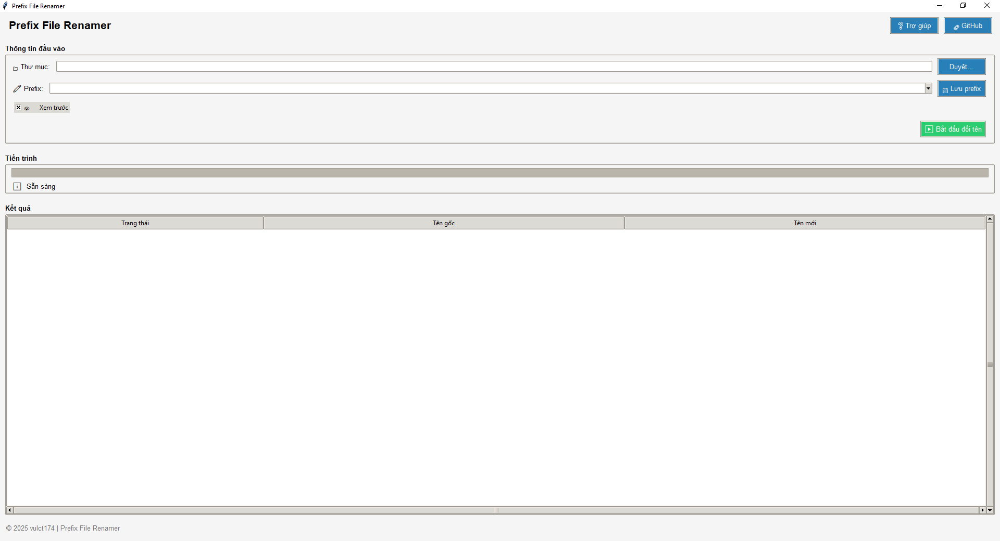

# Prefix File Renamer

Một ứng dụng với giao diện đồ họa hiện đại giúp đổi tên hàng loạt các file trong một thư mục bằng cách thêm tiền tố (prefix) vào đầu tên file.


## Tính năng chính

- **Giao diện người dùng thân thiện** với biểu tượng trực quan
- **Hiển thị kết quả dạng bảng** với mã màu trực quan để dễ theo dõi
- **Lưu trữ và gợi ý các prefix đã sử dụng** để tiết kiệm thời gian
- **Chế độ xem trước** kết quả trước khi thực hiện thay đổi thật
- **Tạo nhật ký (log)** chi tiết của quá trình đổi tên
- **Tiến trình trực quan** để theo dõi quá trình xử lý
- **Chức năng trợ giúp** tích hợp sẵn

## Màn hình ứng dụng



## Cài đặt

### Yêu cầu
- Python 3.6 hoặc mới hơn
- Tkinter (thường đã được cài đặt với Python)

### Cách cài đặt

1. Sao chép (clone) repository này:
```
git clone https://github.com/vulct174/prefix-file-renamer.git
```

2. Di chuyển vào thư mục project:
```
cd prefix-file-renamer
```

3. Chạy ứng dụng:
```
python prefix_renamer_gui.py
```

## Hướng dẫn sử dụng

### Các bước cơ bản

1. **Chọn thư mục chứa file cần đổi tên**
   - Nhấn nút "Duyệt..." để mở hộp thoại chọn thư mục
   - Hoặc nhập trực tiếp đường dẫn vào ô nhập liệu

2. **Chọn hoặc nhập prefix**
   - Nhập prefix mới vào ô nhập liệu
   - Hoặc chọn một prefix đã sử dụng trước đó từ danh sách
   - Nhấn "Lưu prefix" để thêm prefix hiện tại vào danh sách để sử dụng sau này

3. **Xem trước hoặc thực hiện**
   - Tích vào "Xem trước" để kiểm tra các thay đổi trước khi áp dụng
   - Nhấn "Bắt đầu đổi tên" để tiến hành quá trình đổi tên

### Hiểu kết quả hiển thị

Kết quả được hiển thị dưới dạng bảng với các mã màu:
- **Xanh lá**: File đã được đổi tên thành công
- **Vàng**: File đã bị bỏ qua (đã có prefix)
- **Đỏ**: Đã xảy ra lỗi khi đổi tên file

## Đóng góp

Mọi đóng góp đều được hoan nghênh! Nếu bạn muốn đóng góp, vui lòng:

1. Fork repository
2. Tạo nhánh mới (`git checkout -b feature/your-feature-name`)
3. Commit các thay đổi của bạn (`git commit -m 'Add some feature'`)
4. Push lên nhánh của bạn (`git push origin feature/your-feature-name`)
5. Tạo Pull Request mới

## Giấy phép

Dự án này được phân phối dưới giấy phép MIT. Xem file [LICENSE](LICENSE) để biết thêm chi tiết.

## Tác giả

- [vulct174](https://github.com/vulct174)